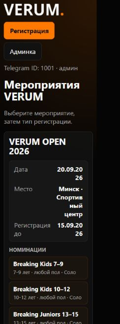
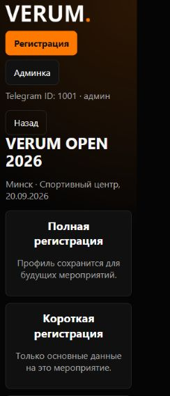
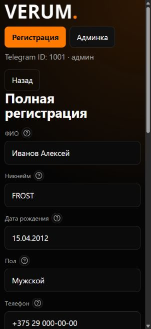
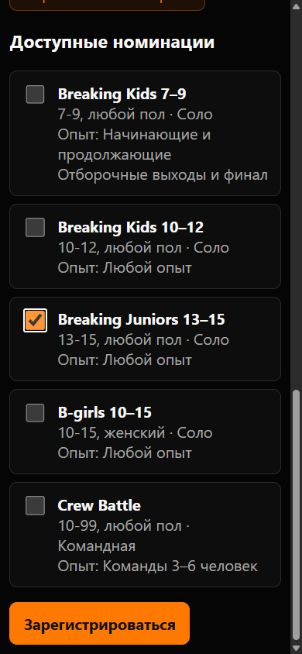
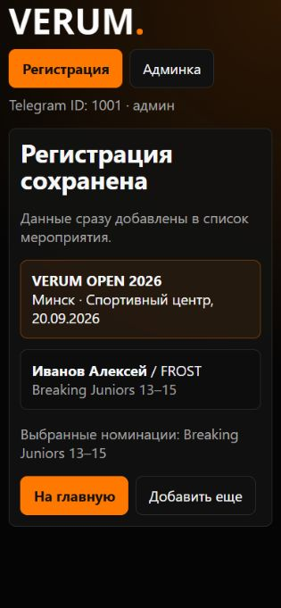
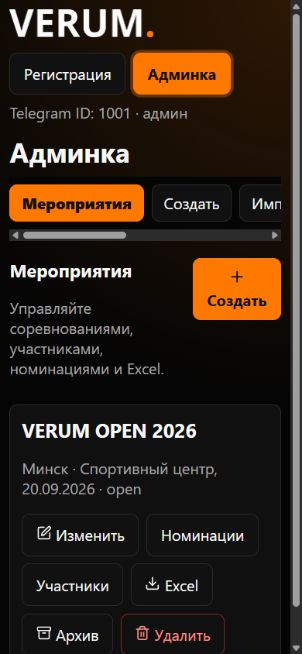
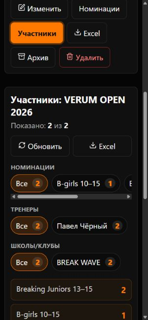
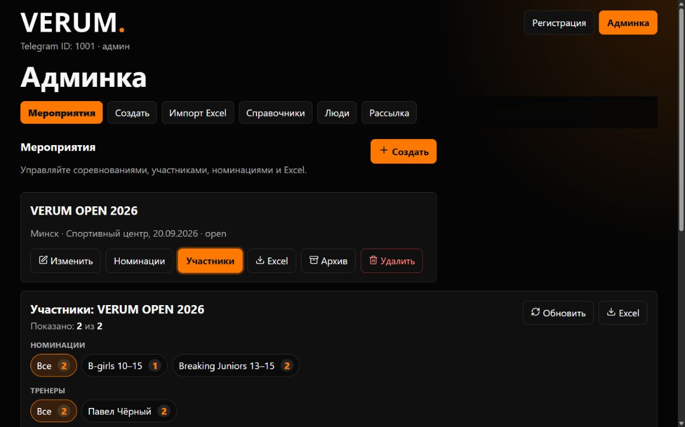

# Полный аудит VERUM Competitions

Дата проверки: 25 августа 2026 года.

## Итог

Бот и Railway production работают, а основные связи данных в PostgreSQL сейчас целы. Однако начинать редизайн с косметических изменений нельзя: в API есть критическая уязвимость авторизации, GitHub и production разошлись по версиям, Alembic не отражает фактическую схему базы, а наличие рабочих резервных копий не подтверждено.

Рекомендуемый порядок: **защитить доступ → сделать и проверить резервную копию → создать staging → выровнять миграции → разделить пользовательскую часть и админку → менять визуал → провести поэтапный deploy**.

## Что проверено

- локальный репозиторий, архитектура frontend/backend, модели, миграции и Docker/Railway-конфигурация;
- production Railway: сервисы, активные deployments, домен, регион, health endpoint, логи, обезличенная схема и агрегаты PostgreSQL;
- GitHub: ветка `main`, deployment status, workflows, branch protection, Dependabot, secret scanning и code scanning;
- фактическая логика полной, короткой и тренерской регистрации, админских действий, экспорта и рассылки;
- текущий интерфейс из ветки `main` в изолированном локальном окружении на мобильном и desktop viewport;
- frontend build, синтаксис Python, npm audit и прямые Python-зависимости через pip-audit.

Production не изменялся. SQL-проверки были только `SELECT`/inspection, персональные значения из базы не извлекались.

## Критические риски

### P0 — Telegram ID используется как пароль

Публичный `POST /api/auth/dev` доступен в production, frontend при любой ошибке Telegram-аутентификации автоматически откатывается к dev-login, а админские маршруты доверяют `X-Telegram-Id` или `admin_id` из query string. Эти значения можно подделать.

Дополнительно без подтверждённой сессии доступны чтение профиля по Telegram ID, список учеников по `coach_id`, создание/изменение/архивация учеников и просмотр регистраций пользователя. Это IDOR: злоумышленник может читать персональные данные и изменять чужие записи прямыми API-запросами.

Доказательства в коде:

- `backend/app/routers/auth.py:31`;
- `backend/app/routers/deps.py:14`;
- `frontend/src/api/client.js:34`;
- `frontend/src/api/client.js:47`;
- `frontend/src/api/client.js:67`;
- `backend/app/routers/profiles.py:52`;
- `backend/app/routers/profiles.py:105`;
- `backend/app/routers/profiles.py:115`;
- `backend/app/routers/profiles.py:126`;
- `backend/app/routers/registrations.py:435`.

Что делать: валидировать Telegram `initData` один раз, выдавать короткоживущую подписанную серверную сессию, получать текущего пользователя только из этой сессии, проверять ownership на каждом profile/student/registration endpoint. Dev-login должен включаться отдельным флагом и быть физически недоступен в production. Админские download URL нельзя авторизовывать через Telegram ID в query string.

### P0 — сервер не применяет ограничения типов регистрации

Флаги `allow_full_registration`, `allow_short_registration`, `allow_coach_registration` скрывают варианты только в UI. Backend-обработчики проверяют статус и даты мероприятия, но не соответствующий `allow_*` флаг. Запрещённый тип заявки можно отправить напрямую.

Что делать: единая серверная функция `ensure_registration_type_allowed(event, type)` для всех трёх endpoint и интеграционные тесты на запрещённые переходы.

### P0 — сохранность production-данных до изменений не подтверждена

В коде есть полное удаление мероприятия вместе с регистрациями и номинациями. Railway volume существует, но расписание backups/PITR через CLI подтвердить не удалось. Staging-окружения в проекте нет. Нельзя выполнять миграции или редизайн, затрагивающий данные, пока не создан `pg_dump`, snapshot/PITR и не проведён тест восстановления.

Что делать до первой записи в production:

1. включить ежедневные/недельные Railway volume backups и PITR;
2. сделать отдельный `pg_dump --format=custom --no-owner` вне Railway;
3. восстановить dump в отдельный staging Postgres;
4. сравнить counts, FK, 256 связей регистрация–номинация и контрольные агрегаты;
5. только после restore drill начинать миграции.

Railway рекомендует сочетать volume backups, PITR и логические dumps: https://docs.railway.com/guides/postgres-backups-restores

## Состояние production-данных

| Сущность | Количество |
|---|---:|
| Пользователи | 134 |
| Полные профили участников | 64 |
| Тренеры | 11 |
| Ученики | 60 |
| Мероприятия | 2 |
| Номинации | 23 |
| Регистрации | 193 |
| Связи регистрация–номинация | 256 |
| Справочник | 9 основных записей + 19 алиасов |

Положительные результаты проверки:

- нет регистраций без номинаций;
- нет связей с номинацией другого мероприятия;
- нет отсутствующих participant/student/coach ссылок по типу заявки;
- нет пустых ФИО/никнеймов, будущих дат рождения и отрицательного возраста;
- нет командных заявок без названия/состава;
- нет некорректных периодов мероприятий;
- все текущие FK/unique constraints присутствуют.

Проблемы данных:

- найдено **9 групп**, где участник повторяется в одной номинации одного мероприятия;
- 39 пользователей не имеют профиля или регистрации — часть может быть нормальной (только запуск бота), автоматически удалять их нельзя;
- есть 2 архивных ученика;
- Alembic считает production базу версией `20260511_0001`, хотя фактическая схема содержит изменения до `0006`.

Дубликаты нельзя удалять автоматически: сначала нужна обезличенная сверка по источнику регистрации, затем решение администратора и таблица соответствия старых/новых ID.

## GitHub

Репозиторий: https://github.com/koych77/VERUM-Competitions-

### Хорошо

- локальный `main`, `origin/main` и GitHub совпадают на `78cee79`;
- рабочее дерево до аудита было чистым;
- secret scanning и push protection включены;
- активных secret-scanning alerts нет;
- `.env` игнорируется, реальных токенов в текущих tracked-файлах не найдено.

### Проблемы

- production запущен с `e86031e`, а `main` — `78cee79`; deployment последнего коммита был отменён до build;
- отсутствуют GitHub Actions, тесты и обязательные status checks;
- `main` не защищён, прямой push может сразу затронуть production;
- Dependabot security updates выключены, code scanning не настроен;
- npm audit: 5 проблем в build-chain (3 high, 1 moderate, 1 low), включая старый Vite/PostCSS/nanoid;
- pip-audit прямых зависимостей: `python-multipart==0.0.17` имеет 7 известных уязвимостей; для используемых upload/import endpoint актуальны DoS-риски, исправление — минимум `0.0.31` после совместимой проверки;
- последние коммиты имеют placeholder-автора `Your Name <your@email.com>`;
- реальные Telegram ID админов опубликованы в `.env.example` и README. Сами ID не являются секретами, но при текущей схеме авторизации они превращаются в ключ к админке.

Рекомендация: protected `main`, feature branches + PR, CI `frontend build + tests + Python tests + migration check + dependency audit`, staging deploy перед production, ручное production approval.

## Railway

Проект: https://railway.com/project/7e8744db-8de9-4f4e-a0cb-5e2700159146

### Фактическое состояние

- application и PostgreSQL имеют статус `SUCCESS`, остановленных deployment нет;
- production domain и `/api/health` отвечают 200;
- Telegram webhook получает запросы и отвечает 200;
- активный application deployment создан 20 мая 2026 года из `e86031e`;
- последняя попытка `78cee79` имеет статус `REMOVED`/cancelled и не дошла до build;
- Postgres deployment обновлён Railway 4 августа 2026 года;
- app: 1 replica в US East `us-east4-eqdc4a`;
- Postgres volume: примерно 224.7 MB из 5 GB;
- `railway.json` не задаёт `healthcheckPath` и `preDeployCommand`;
- есть только `production`, staging отсутствует;
- резервные копии/PITR не были подтверждены: dashboard потребовал отдельную авторизацию, CLI не показал backup schedule.

Из Минска 5 последовательных запросов к health дали 429–937 ms, медиана около 479 ms. Это не полноценный load test, но вместе с US East указывает на необходимость проверить EU West. Railway предлагает Amsterdam (`europe-west4-drams3a`), однако перенос Postgres volume вызывает downtime — только после backup/restore drill: https://docs.railway.com/deployments/regions

### Операционные улучшения

1. добавить deploy healthcheck `/api/health` и отдельную readiness-проверку БД;
2. добавить staging service + отдельную staging database;
3. вынести `alembic upgrade head` в контролируемый pre-deploy step после baseline;
4. настроить external uptime monitor и алерты на 5xx/webhook failures;
5. оценить EU West для app и БД, измерить p50/p95 до/после;
6. не масштабировать приложение на несколько replicas, пока startup-DDL и table lock не переработаны.

## Логика и архитектура

### Высокий приоритет

- `App.jsx` — около 2 500 строк: пользовательские сценарии, admin, бизнес-валидация, API и визуальные компоненты связаны в одном файле;
- `main.css` — около 1 200 строк без оформленного набора design tokens/компонентов;
- `events.py` и `registrations.py` слишком крупные и смешивают HTTP, бизнес-правила и persistence;
- `create_all()` + самописный `run_lightweight_migrations()` выполняют DDL на старте, а Alembic остаётся на `0001`; при нескольких replicas возможны гонки;
- тренерский frontend сначала создаёт учеников отдельными запросами, затем общую регистрацию. Если последний запрос падает, новые ученики остаются, а retry может создать дубли;
- пользовательские submit-кнопки не имеют `isSubmitting`, disabled и защиты от двойного нажатия;
- часть ошибок API преобразуется в пустой список, поэтому сеть/500 выглядят как «нет мероприятий» или «нет номинаций»;
- обновление мероприятия пересчитывает возраст, но изменения правил номинаций не перепроверяют уже существующие заявки;
- создание duplicate event молча возвращает старое событие, а UI сообщает, что новое создано;
- broadcast выполняется внутри HTTP request, не имеет campaign ID, preview/test recipient и серверной идемпотентности;
- бот обрабатывает только `/start`; остальные сообщения фиксируются как `not handled`, пользователь не получает помощь.

### Предлагаемая структура

Без второго frontend-репозитория на первом этапе:

```text
frontend/src/
  app/                bootstrap, routes, session
  ui/                 Button, Field, Card, Notice, Dialog, Spinner
  features/events/
  features/registration/
    full/
    short/
    coach/
  features/admin/
    events/
    participants/
    directories/
    broadcasts/
  shared/api/
  shared/validation/

backend/app/
  auth/               Telegram session, ownership, admin policy
  routers/             thin HTTP layer
  services/            transactions and business rules
  repositories/        only where queries repeat
  models/
  schemas/
```

Не нужен тяжёлый новый framework. React/Vite и FastAPI можно сохранить; главное — границы модулей, нормальная сессия, транзакции и тесты.

## UX/UI-аудит

Скриншоты сделаны из текущего `main` в локальной изолированной копии с audit-only данными. Production не открывался через frontend, потому что текущий dev fallback мог бы создать/изменить пользователя в рабочей базе.

### Шаг 1 — список мероприятий: требует исправления



- сильные стороны: понятный основной CTA, видны дата, место, срок и номинации;
- проблемы: header занимает много высоты, Telegram ID раскрывается без пользы, длинное место разваливается по буквам из-за двухколоночной `.event-meta` на узком экране;
- исправление: компактный header в одну строку, скрыть ID, на ширине до 380 px переключить metadata в вертикальный label/value.

### Шаг 2 — выбор типа: работоспособно, но перегружено



- три равнозначные крупные карточки заставляют пользователя сначала понимать внутренние термины;
- лучше задать вопрос «Кого регистрируем?» и показать: «Себя», «Участника без сохранения профиля», «Учеников» с короткими последствиями;
- добавить подсказку, какой вариант обычно нужен.

### Шаг 3 — данные участника: высокий UX-риск



- одна длинная страница без шага/прогресса и итоговой проверки;
- обязательность полей не обозначена визуально;
- подсказки вложены кнопкой внутрь `<label>`, а DOM snapshot показывает textbox без доступного имени;
- нативные `<select>` имеют `appearance: none`, но стрелка не добавлена — поле пола выглядит как обычный input;
- correction-кнопки увеличивают высоту формы, вместо предсказуемого autocomplete/normalization on blur.

### Шаг 4 — выбор номинаций: высокий UX-риск



- длинный список карточек без счётчика выбранных и краткого summary;
- CTA находится только в самом низу;
- нет состояния «Отправляю…» и блокировки повторного нажатия;
- network error и реальный empty state не различаются.

Решение: шаги `Данные → Номинации → Проверка`, sticky CTA с safe-area, selected counter, retry/error block и серверная идемпотентность.

### Шаг 5 — успех: хорошая основа



- результат, мероприятие, участник и номинация подтверждены явно;
- добавить «Открыть/изменить заявку» и уточнить «Добавить другого участника» вместо неоднозначного «Добавить ещё»;
- success-сообщение должно иметь `role=status`/`aria-live`.

### Шаг 6 — мобильная админка: требует перестройки



- шесть разделов обрезаются в горизонтальном scroll без явного признака продолжения;
- заголовок «Админка» и navigation занимают много места;
- `open` показан техническим английским статусом;
- архивирование выполняется без подтверждения и без loading state.

### Шаг 7 — участники на мобильном: неудобно



- сначала остаётся карточка мероприятия, затем открывается отдельная панель участников;
- внутри экрана несколько независимых горизонтальных лент фильтров;
- сложно увидеть активные фильтры и вернуться к полному списку;
- предложено: отдельный route/screen, поиск, одна кнопка «Фильтры (N)», bottom sheet на mobile и sidebar/filter bar на desktop.

### Шаг 8 — desktop админка: работоспособно, но пространство используется слабо



- основной контент остаётся узкой левой колонкой с большим пустым полем справа;
- участники размещены ниже event card, а не как самостоятельный рабочий экран;
- лучше: desktop shell 1200–1360 px, sidebar или компактные tabs, таблица/карточки в правой области, route-level breadcrumbs.

## Визуальная система

Текущий визуал последователен по цветам, но почти все элементы используют одинаковые 8 px radius, тонкую тёмную рамку и близкие чёрные поверхности. Из-за этого иерархия слабая.

Проверка контраста:

- обычный/оранжевый текст имеет хороший контраст;
- рамка `#2b2b2b` на input `#0b0b0b` — примерно **1.39:1**, ниже ориентира 3:1 для границ интерактивных компонентов;
- hint target 22×22 px, admin tabs 38 px — слишком мало для надёжного mobile touch;
- состояния loading/success/error не имеют единой семантики и `aria-live`;
- headings перескакивают с `h1` на `h3`/`h4`.

Рекомендованный visual direction: сохранить VERUM black/orange, но добавить три уровня поверхностей, более заметные границы, radius 12/16, spacing scale 4/8/12/16/24/32, компактную типографику без uppercase для длинного контента и один явно доминирующий CTA на экран.

## Варианты реализации

### Вариант 1 — рекомендованный: один репозиторий, два интерфейсных layout

- пользовательский Telegram Mini App — mobile-first;
- админка — отдельный `/admin` layout/route с desktop-first рабочими экранами;
- общий backend, база и design system;
- данные и ID сохраняются, миграции только additive/backfilled.

Плюсы: минимальный инфраструктурный риск, понятный UX для двух разных аудиторий, проще постепенный deploy. Минус: потребуется разделить текущий `App.jsx`, не просто перекрасить CSS.

### Вариант 2 — быстрый facelift текущего SPA

- оставить одну структуру и исправить цвета, отступы, рамки, формы и responsive CSS.

Плюсы: быстрее. Минусы: не решает смешение user/admin, длинные сценарии, маршрутизацию, тестируемость и безопасность; технический долг останется.

### Вариант 3 — отдельный admin frontend/service

- Mini App и admin становятся отдельными приложениями с общим API.

Плюсы: максимальная изоляция и независимый release cycle. Минусы: больше Railway-сервисов, CI/CD и поддержки. Сейчас преждевременно.

**Рекомендую вариант 1.** Он даёт заметное улучшение структуры и визуала без рискованного полного rewrite и без переноса существующих участников.

## Безопасный план работ

### Нужно до редизайна

1. backup + PITR + offsite dump + restore drill;
2. закрыть auth/IDOR и серверные permission checks;
3. создать staging, включить branch protection и CI;
4. выровнять Alembic с реальной схемой через schema diff/baseline, не `stamp` вслепую;
5. зафиксировать контрольные counts и 9 duplicate groups, ничего не удалять автоматически;
6. обновить уязвимые зависимости и добавить request size/rate limits;
7. синхронизировать GitHub `main` и production deployment.

### Затем структура и UX

1. выделить session/auth и тонкий API client;
2. разделить user/admin layouts и feature-модули;
3. добавить route/history/back/refresh-safe состояние;
4. внедрить базовые UI-компоненты и design tokens;
5. перестроить регистрацию в 3 шага с review;
6. перестроить admin events/participants как отдельные экраны;
7. добавить loading/empty/error/partial/success states и double-submit protection;
8. добавить unit/integration/UI tests;
9. rollout staging → canary/manual production → post-deploy data audit.

## Ограничения проверки

- реальные Railway backup schedules/PITR не подтверждены: CLI их не показал, web dashboard не был авторизован;
- не выполнялась запись в production и не проверялось восстановление backup;
- реальный Telegram WebView на iOS/Android не тестировался; использован локальный production build текущей ветки `main` и изолированный mock API;
- production сейчас не показывает публичных мероприятий, поэтому рабочий регистрационный flow визуально проверен локально;
- полный transitive Python audit не завершился на локальном Python 3.14 из-за сборки `pydantic-core`; прямые pinned-зависимости проверены;
- не выполнялись нагрузочные, pentest и полноценные WCAG-тесты с screen reader.
